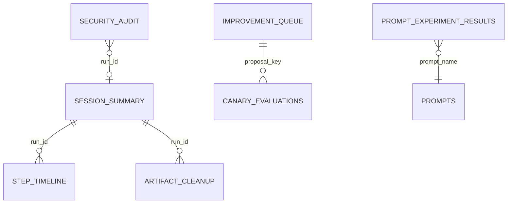

# DBeaver connections

Use three visually distinct connections under the `Google Connector` folder.

## Production

- Name: `Google Connector — PRODUCTION NEON READ ONLY`
- Folder: `Google Connector/Production`
- Color: red
- SSL: required
- Role: `dbeaver_analyst`
- Transaction mode: read only
- Schemas: prefer `reporting`; the role cannot read OAuth credentials.

Create/rotate the role with `scripts/configure_reporting_role.sql` using the Neon owner connection. Store the generated password only in DBeaver secure storage/macOS Keychain.

## Local Homebrew

- Name: `Google Connector — LOCAL HOMEBREW`
- Folder: `Google Connector/Local`
- Color: green
- Host: `::1` (or the authoritative Homebrew socket/host)
- Port: `5432`
- Database/user: `agent_db` / `agent_user`

## Local Docker

- Name: `Google Connector — LOCAL DOCKER`
- Folder: `Google Connector/Local`
- Color: blue
- Host: `127.0.0.1` (explicit IPv4 avoids the local Homebrew listener)
- Port: `5433` (container port remains 5432)
- Database/user: `agent_db` / `agent_user`

Never commit DBeaver credentials or a Neon owner URL. Use the reporting views for run status, timelines, failures, tokens, retrieval, artifacts, improvements, and canaries.

## Reporting relationship map

Refresh the `reporting` schema after migration 006. The dedicated role can select
`session_summary`, `step_timeline`, `failure_summary_daily`, `model_token_usage`,
`tool_reliability`, `retrieval_quality`, `artifact_cleanup`, `improvement_queue`,
`canary_evaluations`, `prompt_experiment_results`, and `security_audit`. It still
cannot read encrypted OAuth credential rows.
